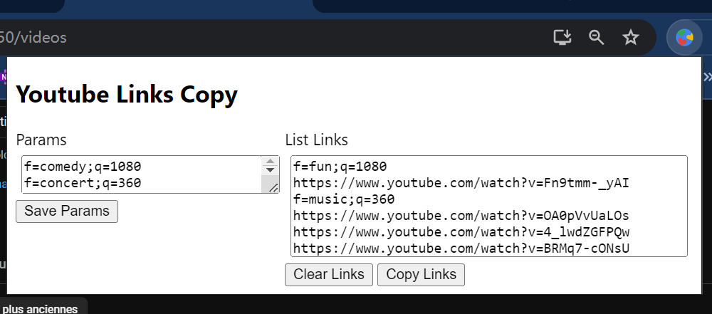
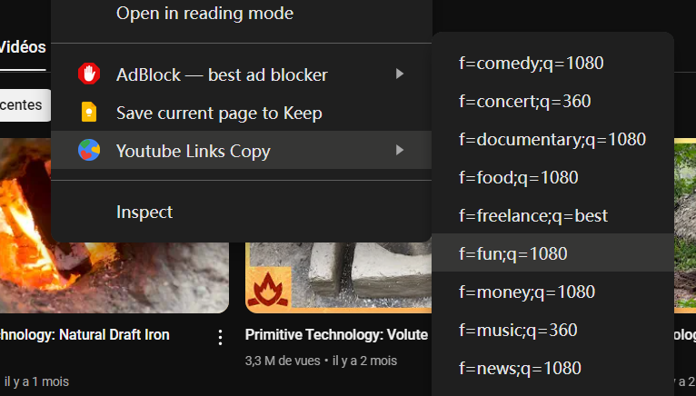

## Overview

This chrome extension is useful for the YoutubeDownloader tool in my repo : https://github.com/hejoseph/YoutubeDownloader.

When browsing Youtube.com, you want to save the video link somewhere and classify it : The extension lets you classify your youtube links as follow :


You just have to save a list of labels in the "params" text area, and click save from the popup of the extension (below for how to install). 

Then "right-click" any videos on youtube.com, you will have the option to choose the label you want to associate the video with :


By clicking the button "copy", it will copy the list of the videos with its labels.
You can directly pass this list to the "YoutubeDownloader" tool to automatically download the full list of videos, classified in its own folder, with the quality you requested.

In the below example, 1 video in 1080p will be in the "fun" folder, and 3 videos in 360p will be in the "music" folder.

```
f=fun;q=1080
https://www.youtube.com/watch?v=Fn9tmm-_yAI
f=music;q=360
https://www.youtube.com/watch?v=OA0pVvUaLOs
https://www.youtube.com/watch?v=4_lwdZGFPQw
https://www.youtube.com/watch?v=BRMq7-cONsU
```

The extension uses `chrome.contextMenus.create()` to populate dynamically the context menu with parameters added by the user in "params" area. 

## Running this extension

1. Clone this repository.
2. Load this directory in Chrome as an [unpacked extension](https://developer.chrome.com/docs/extensions/mv3/getstarted/development-basics/#load-unpacked).
3. Pin the extension to the taskbar to access the action button.
4. Open the extension popup by clicking the action button and interact with the UI.
5. Select the text you want to search and right-click within the selection to view and interact with the context menu.
